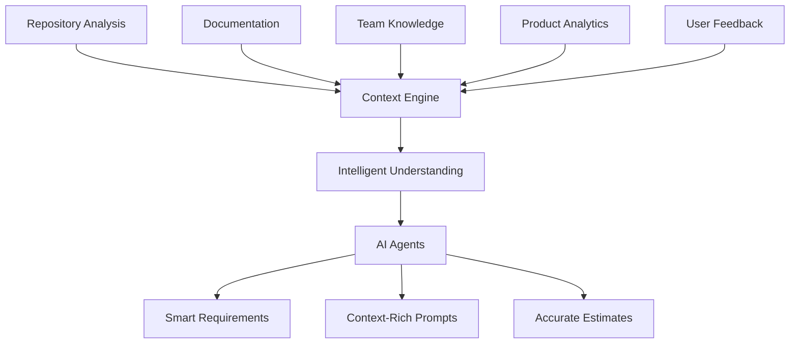
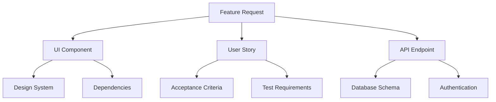

# How Devplan Works

Devplan sits between your existing tools and your AI development workflow — pulling context from repositories, documentation, project management, and team knowledge so every planning session and coding prompt is grounded in your specific product rather than generic assumptions.

---

## Context Understanding Engine

Devplan learns about your project by pulling from multiple sources and synthesizing them into a unified model.

### Repository analysis

When you connect a repository, Devplan analyzes it across six dimensions:

| What gets analyzed | What Devplan learns |
|---|---|
| Tech stack and frameworks | Languages, libraries, and build tools in use |
| Architecture patterns | How the codebase is structured and organized |
| Component conventions | Naming, file organization, and reuse patterns |
| Data models | Database schema and entity relationships |
| API surface area | Existing endpoints and service boundaries |
| Testing patterns | Test structure, coverage approach, and tooling |

This analysis is stored and updated as your codebase evolves.

### Feature Catalogue

The Feature Catalogue is Devplan's structured representation of your product. It stores detailed information about each feature — descriptions, references to related code and documentation, and semantic embeddings that power context-aware search.

| Element | Purpose |
|---|---|
| Feature records | Description, scope, and metadata per feature |
| References | Links to related code files and documentation |
| Embeddings | Vector representations that power semantic search |
| Feature IDs (ULIDs) | Stable unique identifiers per feature |

The Catalogue can be bootstrapped from an existing codebase by analyzing your repository and connected issue trackers. You can also build it incrementally as you plan new features.

### Attachments

| Level | Scope | Examples |
|---|---|---|
| Workspace | Available across all projects | Architecture decision records, design systems, company standards |
| Project | Scoped to a single project | Feature mockups, research notes, customer feedback |

Image attachments receive AI-generated descriptions so their content is accessible to agents in text-only contexts.

---

## Intelligent Relationships

Devplan maps the relationships between everything it knows — connecting technical components, product requirements, and team knowledge into a unified model. This is what allows context to flow across your project ecosystem rather than treating each feature in isolation.

These relationships power three things in practice:

**Impact analysis** — when you plan a new feature, Devplan knows which existing components, APIs, and data models it touches, so generated specs include accurate integration guidance rather than generic advice.

**Dependency tracking** — user stories are sequenced based on what needs to exist before each can be implemented, surfacing blockers before they become problems during development.

**Context preservation** — decisions made during planning stay connected to the tasks they produced. When an engineer opens a task in their AI IDE, the full chain from business requirement to technical constraint is available.

---

## AI Agents

Devplan uses multiple specialized agents that collaborate during planning and review.

| Agent | Role |
|---|---|
| Planning Agent | Runs requirement discovery, asks targeted questions grounded in your codebase |
| Review Agent | Evaluates generated PRDs for completeness, clarity, feasibility, and alignment |
| Embedding Agent | Processes attachments and generates descriptions for images and documents |

---

## Integrations

Devplan syncs two-ways with both Linear and Jira — Devplan pushes structure and changes in either tool sync back to Devplan. See [Integrations](/guides/integrations/jira) for setup details.

### CLI

The CLI pulls user story context from Devplan and writes a context file for your AI IDE.

| Context file section | Contents |
|---|---|
| Project context | Tech stack, frameworks, and architecture summary |
| Current task | Story description and acceptance criteria |
| Code patterns | Conventions and patterns from your codebase |
| File references | Specific paths relevant to the task |
| Repository guidance | Team-maintained notes on conventions and decisions |

---

## Access Control

| Role | Key permissions |
|---|---|
| Owner | Full access — manage content, users, roles, billing, and settings |
| Editor | Create and edit content and projects, manage integrations, no user management |
| Projects Owner | Full project and document management, manage integrations, no user management |
| Engineering | View all content, manage repositories and technical tools, regenerate tasks |
| Product | View all content, manage repositories and integrations, regenerate user stories |
| Marketing | View all content, create comments, read-only on most features |
| Viewer | Read-only access to all company content |

Permissions are cumulative when users have multiple roles. Only Owners can manage user roles and company settings.

| Permission | Owner | Editor | Projects Owner | Engineering | Product | Marketing | Viewer |
|---|---|---|---|---|---|---|---|
| Create/Edit PRD | ✅ | ✅ | ✅ | ❌ | ✅ | ❌ | ❌ |
| Create/Edit Tech Brief | ✅ | ✅ | ✅ | ✅ | ❌ | ❌ | ❌ |
| Delete Projects | ✅ | ✅ | ✅ | ❌ | ❌ | ❌ | ❌ |
| Linear/Jira Sync | ✅ | ✅ | ✅ | ✅ | ✅ | ❌ | ❌ |
| Regenerate User Stories | ✅ | ✅ | ✅ | ❌ | ✅ | ❌ | ❌ |
| Regenerate Tasks | ✅ | ✅ | ✅ | ✅ | ❌ | ❌ | ❌ |
| Manage Users and Roles | ✅ | ❌ | ❌ | ❌ | ❌ | ❌ | ❌ |

---

## Data Privacy

Devplan analyzes code structure and metadata — it does not store your source code, proprietary business logic, credentials, or customer data. Component names, API paths, table names, framework identifiers, and code patterns are stored as metadata only.

For security-sensitive environments, Devplan supports a hybrid deployment model where codebase analysis runs on-premises while collaboration features run in the cloud.
