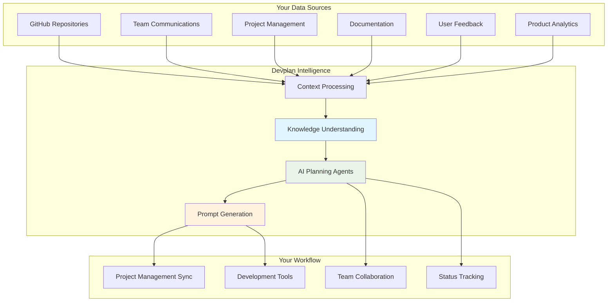
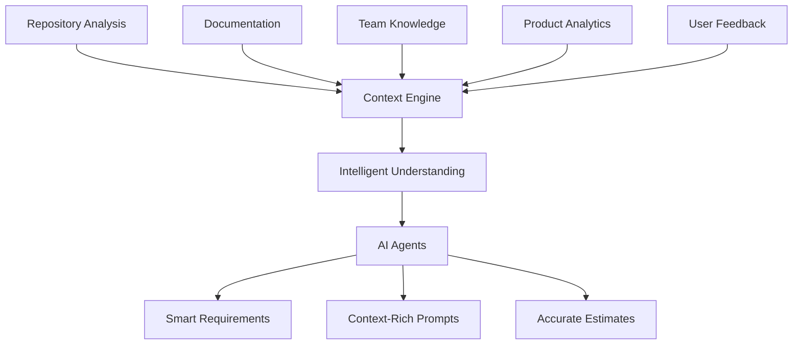
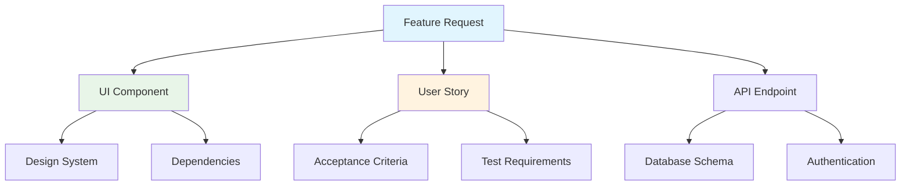
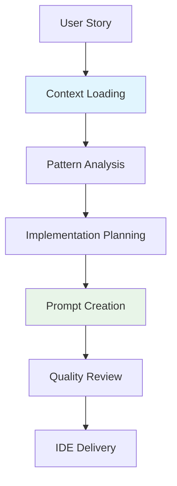
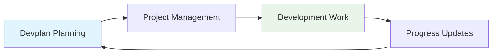

# How Devplan Works

*12 min read • Understanding Devplan's context engine, AI agents, and integration capabilities*

Devplan transforms product development by connecting context from across your development ecosystem into intelligent, 
AI-powered workflows. This guide explains how the platform works and what makes it uniquely effective for AI-assisted development.

## Platform Overview

**Core Design Principles:**
- 🧠 **Context-First Design** - Every feature preserves and enhances project context
- ⚔️ **AI-Native Experience** - Built specifically for AI-assisted development workflows
- 🔗 **Integration-Centric** - Connects your existing tools without replacing them
- 🛡️ **Security by Design** - Enterprise-grade security and privacy protection

## Core Capabilities

### 1. Context Understanding Engine

**How Devplan Learns About Your Project:**

#### What Gets Analyzed

**🏗️ Technical Understanding:**
- **Framework Detection:** Automatically identifies your tech stack (React, Guice, FastAPI, etc.)
- **Architecture Patterns:** Understands your project structure and conventions
- **Component Relationships:** Maps how different parts of your system connect
- **Database Schema:** Analyzes your data models and relationships
- **API Structure:** Understands your endpoints and integration points

**👥 Team & Process Intelligence:**
- **Code Standards:** Learns your team's coding conventions and patterns
- **Review Processes:** Understands your quality and approval workflows
- **Testing Approaches:** Identifies your testing frameworks and coverage expectations
- **Deployment Patterns:** Maps your CI/CD and release processes

**📊 Product Intelligence:**
- **User Flows:** Maps customer journeys through your product
- **Feature Dependencies:** Understands how features relate and interact
- **Business Rules:** Captures domain logic and constraints
- **Performance Requirements:** Identifies speed and scale considerations

### 2. Intelligent Processing Pipeline

**How Context Flows Through Devplan:**

#### Stage 1: Data Collection
**Multi-Source Intelligence Gathering:**
- **Repository Analysis:** Scans your codebase structure, patterns, and conventions
- **Documentation Import:** Processes existing specs, READMEs, and team wikis
- **Project History:** Analyzes past tickets, pull requests, and decisions
- **Team Patterns:** Learns from communication and workflow preferences
- **User Feedback:** Incorporates customer insights and analytics data

#### Stage 2: Smart Entity Recognition
**AI-Powered Understanding:**
- **Component Identification:** Recognizes UI components, services, and modules
- **API Mapping:** Understands endpoints, data flows, and integrations
- **Data Model Analysis:** Maps database schemas and relationships
- **Business Rule Extraction:** Identifies domain logic and constraints
- **Integration Discovery:** Finds connections to external services

#### Stage 3: Context Enhancement
**Business Intelligence Layer:**
- **User Journey Mapping:** Connects technical components to user experiences
- **Impact Assessment:** Evaluates business value and risk factors
- **Dependency Analysis:** Maps relationships between features and systems
- **Performance Profiling:** Identifies scalability and optimization opportunities

### 3. Knowledge Graph

**Connecting All Your Project Information:**

Devplan creates an intelligent map of your entire project ecosystem, connecting technical components, business requirements, and team knowledge into a unified understanding.

#### What Gets Connected

**🔧 Technical Elements:**
- **Components:** UI components, services, and modules
- **APIs:** Endpoints, databases, and external integrations
- **Infrastructure:** Development tools, frameworks, and deployment systems
- **Dependencies:** How different parts of your system connect and rely on each other

**📋 Product Elements:**
- **Features:** User-facing functionality and business capabilities
- **Requirements:** User stories, acceptance criteria, and specifications
- **Users:** Personas, customer segments, and usage patterns
- **Goals:** Business objectives, success metrics, and roadmap initiatives

**👥 Team Elements:**
- **Expertise:** Team member skills and domain knowledge
- **Processes:** Workflows, responsibilities, and decision-making patterns
- **History:** Past decisions, lessons learned, and project evolution
- **Communication:** Preferred tools, patterns, and collaboration styles

#### Intelligent Relationships

**How Relationships Help:**
- **Impact Analysis:** Understand what changes when you modify a feature
- **Dependency Tracking:** See what needs to be built first
- **Context Preservation:** Maintain connections between requirements and implementation
- **Knowledge Transfer:** Help new team members understand system relationships

### 4. AI Agent Orchestration

**Specialized AI Agents Working Together:**

Devplan uses multiple specialized AI agents that collaborate to deliver intelligent product development assistance. Each agent has a specific role and deep expertise in its domain.

#### Agent Specializations

**🔍 Discovery Agent - Intelligent Questioning**
- **Purpose:** Conducts context-aware discovery sessions
- **Capabilities:**
  - Asks relevant questions based on your tech stack and existing features
  - Identifies missing requirements and edge cases
  - Suggests improvements based on similar projects
  - Guides product managers through thorough feature exploration

**📋 Planning Agent - Smart Requirements Generation**
- **Purpose:** Creates comprehensive PRDs and technical specifications
- **Capabilities:**
  - Generates detailed requirements based on discovery insights
  - Creates technical architecture recommendations
  - Breaks down features into implementable user stories
  - Provides accurate time and complexity estimates

**✅ Review Agent - Quality Assurance**
- **Purpose:** Acts as an AI Chief Product Officer
- **Capabilities:**
  - Reviews generated documents for completeness and clarity
  - Identifies potential issues and gaps in requirements
  - Suggests improvements and optimizations
  - Ensures consistency with existing product strategy

**💻 Implementation Agent - Development Guidance**
- **Purpose:** Creates context-rich development prompts
- **Capabilities:**
  - Generates specific implementation guidance
  - Includes relevant code patterns and architectural context
  - Provides file-level modification instructions
  - Ensures consistency with existing codebase patterns

### 5. Intelligent Planning System

**How AI Agents Collaborate to Create Better Plans:**

Devplan's planning system combines multiple AI agents, each specialized in different aspects of product development planning.

#### Planning Capabilities

**📋 Smart PRD Generation**
- **Template-Driven Creation:** Uses proven document structures for consistency
- **Context-Aware Content:** Incorporates your existing product knowledge and patterns
- **Stakeholder Optimization:** Tailors content for different audience needs
- **Integration Ready:** Connects with your existing documentation and processes

**🏗️ Technical Architecture Planning**
- **Codebase-Aware Recommendations:** Suggests approaches that fit your existing architecture
- **Component Mapping:** Identifies which parts of your system need modification
- **API Design Guidance:** Plans endpoints and integrations based on existing patterns
- **Database Planning:** Recommends schema changes and migration strategies

**📊 User Story Breakdown**
- **Intelligent Task Division:** Breaks features into logical, implementable pieces
- **Comprehensive Acceptance Criteria:** Includes edge cases and error handling
- **Cross-Functional Requirements:** Considers design, backend, frontend, and testing needs
- **Smart Sequencing:** Orders tasks based on dependencies and team capacity

**⏱️ Roadmap Estimation**
- **AI Complexity Analysis:** Evaluates how well-suited features are for AI-assisted development
- **Historical Learning (coming soon):** Improves estimates based on your team's actual completion times
- **Resource Planning (coming soon):** Considers team capacity and skill distribution
- **Risk Assessment:** Identifies potential blockers and mitigation strategies

### 6. Development Prompt Generation

**Transforming Plans into AI-Ready Development Instructions:**

The final step in Devplan's intelligent workflow is generating rich, context-aware prompts that enable AI coding assistants to produce high-quality, project-specific code.

#### How Prompts Are Created

#### What Makes Prompts Effective

**🎯 Rich Context**
- **Feature Overview:** Clear description of what needs to be built and why
- **Technical Architecture:** Understanding of your existing system and patterns
- **Integration Points:** How the new feature connects to existing functionality
- **Success Criteria:** Specific acceptance criteria and testing requirements

**📝 Implementation Guidance**
- **File-Level Instructions:** Specific files to create or modify
- **Code Patterns:** Your team's established conventions and approaches
- **Existing Resources:** Utilities, helpers, and components to leverage
- **Edge Case Handling:** Error scenarios and validation requirements

**💡 Practical Examples**
- **Codebase Patterns:** Real examples from your existing code
- **Integration Samples:** How similar features were implemented
- **Testing Approaches:** Your team's testing frameworks and patterns
- **Documentation Standards:** Commenting and documentation conventions

#### Result: Better AI Code Generation

**With Devplan Context:**
- ✅ Code follows your existing patterns and conventions
- ✅ Integrates properly with your current architecture
- ✅ Uses your preferred libraries and frameworks
- ✅ Includes appropriate error handling and validation
- ✅ Matches your team's coding standards and style

**Without Context (Generic AI):**
- ❌ Generic code that doesn't fit your project
- ❌ Wrong libraries or outdated patterns
- ❌ Missing integration with existing systems
- ❌ Inconsistent with your team's standards
- ❌ Requires significant rework and adaptation

## Integration Capabilities

### CLI Integration

**Bringing Context Directly into Your Development Environment:**

The Devplan CLI bridges the gap between planning and implementation by delivering rich project context directly into your preferred IDE.

#### Key CLI Features

**🔑 Authentication & Project Management**
- Secure authentication with your Devplan account
- Project linking and context synchronization
- Multi-project support for complex development workflows

**📥 Context Delivery**
- Automatic download of feature requirements and specifications
- Real-time synchronization of project updates
- IDE-specific configuration file generation

**📊 Progress Tracking**
- Automatic status reporting and progress updates
- Integration with project management tools
- Real-time team collaboration and communication

#### IDE Integration

**Supported Development Environments:**
Cursor, Claude Code, Jetbrains IDEs, and more.

**What Your IDE Receives:**
- **Project Context:** Framework, architecture, and coding patterns
- **Current Task:** Feature requirements and acceptance criteria
- **Implementation Guidance:** Specific files to modify and patterns to follow
- **Code Examples:** Relevant patterns from your existing codebase

### Real-Time Synchronization

**Live Updates Between Planning and Development:**

- **Requirement Changes (coming soon):** Automatic updates when specifications change
- **New Tasks (coming soon):** Immediate notification of new user stories or features
- **Progress Tracking (coming soon):** Real-time status updates across the team
- **Context Refresh:** Automatic synchronization of project knowledge

## Project Management Integration

**Seamless Connection with Your Existing Workflow:**

Devplan integrates with your current project management tools to ensure context and progress flow smoothly 
between planning and execution.

#### Supported Integrations

**📊 Linear Integration**
- **Automatic Ticket Creation:** User stories become Linear tickets with full context
- **Bi-Directional Sync (coming soon):** Status updates flow between Devplan and Linear
- **Context Preservation:** Links back to original requirements and technical specs
- **Team Collaboration (coming soon):** Comments and discussions stay connected across platforms

**🎯 Jira Integration**
- **Epic Management:** Complex features become properly structured epics
- **Custom Field Mapping:** Devplan data maps to your existing Jira fields
- **Sprint Planning (coming soon):** Stories come with estimates for capacity planning
- **Workflow Automation (coming soon):** Status transitions trigger updates in both systems

**🔄 Data Flow**

#### Benefits of Integration

**For Teams:**
- **No Workflow Disruption:** Keep using your existing project management tools
- **Rich Context:** Every ticket includes links to requirements and technical specs
- **Automatic Updates:** Progress flows between systems without manual work
- **Better Planning:** Estimates and dependencies are clearly defined

**For Managers:**
- **Real-Time Visibility:** See progress on features from planning through completion
- **Context Preservation:** Understand the "why" behind every task and decision
- **Improved Estimates:** AI-powered estimates improve over time with actual data
- **Reduced Overhead:** Less time spent on status updates and project coordination

## Security & Privacy

### Enterprise-Grade Security

**Multi-Layer Protection:**

Devplan is built with security and privacy as core design principles, ensuring your code and business information remain protected.

#### Data Protection

**What We Analyze vs. What We Store:**

**✅ Analyzed for Context:**
- Code structure and architectural patterns
- Component relationships and dependencies
- Framework and technology usage
- Database schema relationships
- API endpoint patterns

**✅ Stored as Metadata Only:**
- Component names and types (e.g., "UserProfile", "LoginForm")
- API endpoint paths (e.g., "/api/users", "/api/auth")
- Database table names (e.g., "users", "sessions")
- Framework identification (e.g., "Next.js 14", "Prisma")
- Code patterns (e.g., "Server Actions", "Zod validation")

**❌ Never Stored:**
- Your actual source code or implementation details
- Proprietary business logic or algorithms
- API keys, passwords, or credentials
- Customer data or personally identifiable information
- Sensitive business information or trade secrets

#### Security Measures

**Data Encryption:**
- End-to-end encryption for all data in transit
- AES-256 encryption for data at rest
- Secure key management and rotation

**Access Control:**
- Role-based access control (RBAC)
- Team-level permission management
- API key and token management
- Comprehensive audit logging

**Privacy Protection:**
- Code analysis in secure, isolated environments
- No code storage beyond necessary metadata

### Enterprise Deployment Options

**Flexible Deployment Models:**

**☁️ Cloud-Hosted (Standard):**
- Fully managed Devplan infrastructure
- Automatic updates and scaling
- 99.9% uptime SLA
- Global data centers for performance

**🔗 Hybrid (Enterprise):**
- Sensitive analysis on-premises (contextify)
- Collaboration features in the cloud
- Flexible data residency options
- Custom integration capabilities

## Performance & Scalability

### Built for Scale

**Enterprise-Ready Architecture:**

Devplan is designed to handle everything from small startups to large enterprise teams with thousands of developers.

#### Scalability Features

**🏗️ Distributed Architecture:**
- **Microservices Design:** Independent scaling of different platform components
- **Auto-Scaling:** Automatic resource allocation based on demand
- **Load Balancing:** Intelligent request distribution for optimal performance
- **Global Deployment (coming soon):** Multi-region infrastructure for low latency worldwide

**⚡ Performance Optimization:**
- **Intelligent Caching:** Multi-layer caching for sub-second response times
- **Context Pre-Computation:** Background processing to minimize wait times
- **Smart Prefetching:** Anticipates and loads likely-needed context data
- **Parallel Processing:** Concurrent analysis and generation for faster results

#### Real-World Performance

**Measured Performance Metrics:**

| Operation | Performance | Scale                    |
|-----------|-------------|--------------------------|
| **Repository Analysis** | 2-5 minutes | Up to 1GB repos          |
| **Context Loading** | `<500ms` | Any project size         |
| **Agent Response** | 3-15 seconds | Complex feature planning |
| **CLI Sync** | `<1 second` | Real-time updates        |
| **Concurrent Users** | No limits | Enterprise-scale teams   |

### Performance Monitoring

**Real-Time System Health:**

**📊 Platform Metrics:**
- System response times and throughput
- AI agent performance and accuracy
- Cache hit rates and optimization effectiveness
- Error rates and system reliability

**📈 User Experience Metrics:**
- Feature completion times
- User satisfaction and adoption rates
- Time savings and productivity improvements
- Integration success rates

**🚨 Proactive Monitoring:**
- Automatic performance alerts and optimization
- Continuous system health checks
- 24/7 monitoring and support

## Why This Matters for Your Team

### User Benefits

**For Product Managers:**
- ✅ **Faster Planning** - AI agents understand your product and ask relevant questions
- ✅ **Better Requirements** - Context-aware generation produces complete, actionable specs
- ✅ **Seamless Handoffs** - Technical context flows directly to engineering teams
- ✅ **Real-Time Collaboration** - Work with engineers in shared, intelligent workspace

**For Engineering Teams:**
- ✅ **Rich Context** - AI coding tools receive detailed, project-specific guidance
- ✅ **Reduced Rework** - 25% improvement in AI-generated code quality
- ✅ **Clear Requirements** - No more guessing what product managers meant
- ✅ **Integrated Workflow** - Context flows directly into your preferred IDE

**For Organizations:**
- ✅ **Accelerated Delivery** - 8x faster planning cycles with maintained quality
- ✅ **Better Resource Utilization** - Teams spend time building, not clarifying
- ✅ **Reduced Risk** - Clear specifications and context prevent project failures
- ✅ **Competitive Advantage** - First-mover benefit in AI-native development

### Platform Advantages

**🧠 Context-First Design:**
- Every feature preserves and enhances project understanding
- No context loss between planning and implementation phases
- Purpose-built for AI workflows, not retrofitted legacy tools
- Security and privacy designed from the ground up

**📊 Measurable Impact:**
- **Repository Analysis:** 5-10 minutes vs. days of manual documentation
- **Context Loading:** `<500ms` vs. hours of investigation and research
- **AI Prompt Quality:** 25% better code generation through rich context
- **Team Synchronization:** Real-time updates vs. manual status reporting

### Getting Started

**Experience the Difference:**
- 📖 **[Try the workflow](/core-workflow)** - See how context flows from idea to code
- 🚀 **[Get started](/getting-started)** - Set up your first project in 15 minutes
- 💡 **[Understand the value](/value-proposition)** - See quantified benefits and ROI

**Enterprise Solutions:**
- 🏢 **On-premises deployment** for security-sensitive environments
- 🔌 **Custom integrations** for proprietary tools and workflows
- 📞 **Dedicated support** with SLA commitments and performance guarantees

**Questions?** Contact our team at info@devplan.com or book a demo to see Devplan in action.

Devplan's architecture enables true context-driven, AI-native product development—bridging the gap between planning and implementation while scaling with your team's needs.