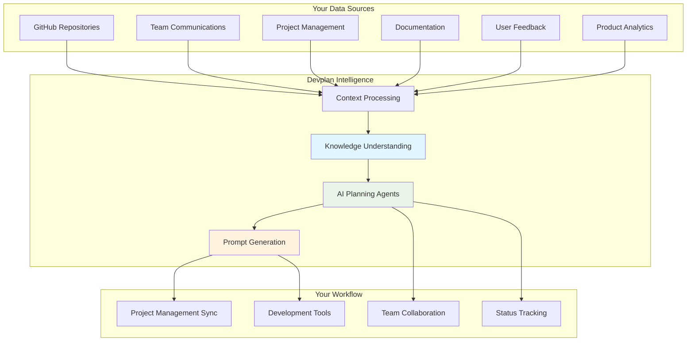
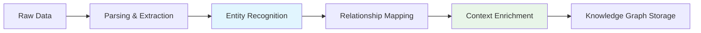
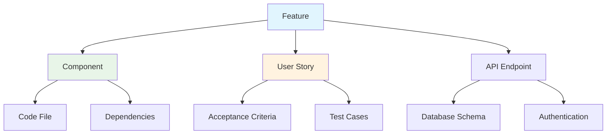
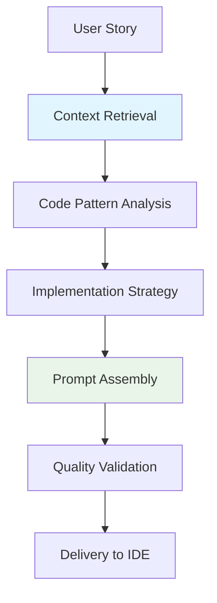
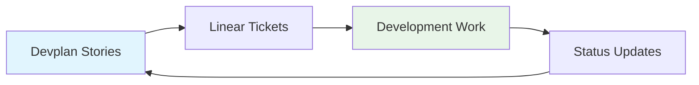

# How Devplan Works

Devplan transforms product development by connecting context from across your development ecosystem into intelligent, AI-powered workflows. This guide explains how the platform works and what makes it uniquely effective for AI-assisted development.

## Platform Overview



## Core Capabilities

### 1. Context Understanding

Devplan analyzes and understands the context of your product development environment to provide intelligent assistance.

#### What Devplan Learns About Your Product

**📂 Codebase Knowledge**
- Architecture patterns and structure
- Component relationships and dependencies
- Coding conventions and standards
- Framework and technology choices

**💬 Team Knowledge**
- Decision-making patterns
- Communication preferences
- Role responsibilities
- Historical project learnings

**📋 Product Knowledge**
- Feature relationships and user flows
- Business logic and domain models
- Integration points and APIs
- Success metrics and goals

**👥 User Understanding**
- Customer feedback patterns
- Usage analytics insights
- Support ticket trends
- Feature request priorities

### 2. Context Engine

The Context Engine is the heart of Devplan's intelligence, responsible for processing raw data into actionable insights.

#### Key Capabilities

**🔍 Code Analysis**
- Automatically identifies architectural patterns
- Understands framework and library usage
- Maps component relationships and dependencies
- Analyzes code quality and conventions

**📊 Product Understanding**
- Maps user flows and feature relationships
- Understands business logic and domain models
- Tracks product evolution and changes
- Identifies integration points and APIs

**🧠 Team Knowledge Extraction**
- Captures team decisions and rationale
- Understands role responsibilities and expertise
- Maps communication patterns and preferences
- Preserves institutional knowledge

#### Processing Pipeline



### 3. Knowledge Graph

The Knowledge Graph stores and connects all extracted information, creating a rich, queryable representation of your product and team context.

#### Entity Types

**Technical Entities**
- Components, services, and modules
- APIs, databases, and integrations
- Development tools and frameworks
- Deployment pipelines and environments

**Product Entities**
- Features, user stories, and requirements
- User personas and customer segments
- Business goals and success metrics
- Product roadmaps and initiatives

**Team Entities**
- Team members and their expertise
- Roles and responsibilities
- Communication patterns
- Decision-making processes

#### Relationship Mapping



### 4. AI Agent Orchestrator

The Agent Orchestrator manages and coordinates multiple specialized AI agents, each designed for specific aspects of the product development workflow.

#### Agent Types

**Discovery Agent**
- Conducts intelligent questioning sessions
- Identifies missing requirements and context
- Guides product managers through discovery process
- Suggests relevant examples from similar projects

**Planning Agent**
- Generates comprehensive PRDs and specifications
- Creates technical architecture recommendations
- Breaks down features into implementable tasks
- Provides time and complexity estimates

**Review Agent**
- Acts as an AI Chief Product Officer
- Reviews generated documents for completeness
- Identifies potential issues and gaps
- Suggests improvements and optimizations

**Prompt Generation Agent**
- Creates context-rich coding prompts
- Includes specific file paths and integration points
- Provides implementation guidance and examples
- Ensures consistency with existing code patterns

### 5. Planning Agents

Specialized agents handle different aspects of the planning process, each with deep domain expertise.

#### Agent Capabilities

**📋 PRD Generation**
- Structured document creation using proven templates
- Context-aware content generation
- Stakeholder-specific sections and details
- Integration with existing product documentation

**🏗️ Technical Design**
- Architecture recommendations based on existing codebase
- Component structure and relationship mapping
- API design and integration specifications
- Database schema and migration planning

**📊 User Story Creation**
- Feature breakdown into implementable tasks
- Acceptance criteria with edge case considerations
- Cross-functional requirement identification
- Dependency mapping and sequencing

**⏱️ Estimation and Planning**
- AI complexity analysis for automated implementation
- Time estimation based on historical data
- Resource allocation and capacity planning
- Risk identification and mitigation strategies

### 6. Prompt Engine

The Prompt Engine transforms planning outputs into actionable development instructions for AI coding assistants.

#### Prompt Generation Process



#### Prompt Components

**Context Section**
- Feature overview and business requirements
- Technical architecture and constraints
- Integration points and dependencies
- Success criteria and acceptance tests

**Implementation Guidance**
- Specific file paths and component names
- Code patterns and conventions to follow
- Existing utilities and helpers to leverage
- Error handling and edge case considerations

**Code Examples**
- Relevant patterns from the existing codebase
- Integration examples and snippets
- Testing approaches and frameworks
- Documentation and commenting standards

## Integration Architecture

### CLI Integration

The Devplan CLI provides seamless integration with development workflows, bringing context directly into the IDE.

#### CLI Components

**Authentication & Project Management**
```bash
devplan login              # Authenticate with Devplan
devplan init               # Initialize project
devplan link <project-id>  # Link to existing project
```

**Context Retrieval**
```bash
devplan pull               # Pull latest prompts and context
devplan story <story-id>   # Get specific story context
devplan next               # Get next implementation task
```

**Status Reporting**
```bash
devplan status             # Report current progress
devplan complete           # Mark task as complete
devplan block <reason>     # Report blocking issues
```

#### IDE Integration

**File Generation**
- Automatic `.cursorrules` file creation
- Claude Code integration files
- Context-aware code templates
- Project-specific configuration

**Real-time Updates**
- Live context synchronization
- Progress tracking and reporting
- Automated status updates
- Integration with Git workflows

### Project Management Integration

Bidirectional sync with popular project management tools ensures that context flows seamlessly between planning and execution.

#### Linear Integration

**Capabilities**
- Automatic ticket creation from user stories
- Status synchronization and progress tracking
- Comment and discussion linking
- Attachment and context preservation

**Data Flow**


#### Jira Integration

**Features**
- Epic and story hierarchy management
- Custom field mapping and synchronization
- Sprint planning and capacity management
- Automated workflow transitions

## Data Security & Privacy

### Security Measures

**Data Encryption**
- End-to-end encryption for all data in transit
- AES-256 encryption for data at rest
- Secure key management and rotation
- SOC 2 Type II compliance

**Access Control**
- Role-based access control (RBAC)
- Team-level permission management
- API key and token management
- Audit logging and monitoring

**Privacy Protection**
- Code analysis happens in secure, isolated environments
- No code storage beyond what's necessary for context
- Configurable data retention policies
- GDPR and CCPA compliance

### Data Processing

**Local Analysis Options**
- On-premises deployment available
- Hybrid cloud configurations
- Airgapped environment support
- Custom security implementations

## Scalability & Performance

### Architecture Scalability

**Microservices Design**
- Independent scaling of components
- Fault tolerance and redundancy
- Load balancing and distribution
- Auto-scaling based on demand

**Caching Strategy**
- Multi-layer caching for performance
- Intelligent cache invalidation
- Context pre-computation
- Real-time data synchronization

### Performance Optimization

**Query Optimization**
- Graph database query optimization
- Intelligent indexing strategies
- Lazy loading and pagination
- Real-time search capabilities

**AI Model Efficiency**
- Model fine-tuning for specific domains
- Prompt optimization and caching
- Parallel processing capabilities
- Response time optimization

## Development & Deployment

### Technology Stack

**Backend Services**
- Node.js with TypeScript
- GraphQL API layer
- Neo4j graph database
- Redis for caching
- PostgreSQL for relational data

**AI/ML Infrastructure**
- OpenAI API integration
- Custom model fine-tuning
- Vector similarity search
- Natural language processing

**Frontend Applications**
- React with TypeScript
- Modern state management
- Real-time updates via WebSocket
- Progressive web app capabilities

### Deployment Infrastructure

**Cloud Architecture**
- Multi-region deployment
- Container orchestration with Kubernetes
- CI/CD pipeline automation
- Infrastructure as code

**Monitoring & Observability**
- Application performance monitoring
- Error tracking and alerting
- Usage analytics and insights
- System health dashboards

## Future Architecture

### Planned Enhancements

**Advanced AI Capabilities**
- Multi-agent collaboration workflows
- Custom model training on company data
- Predictive analytics and forecasting
- Automated decision-making systems

**Extended Integrations**
- Design tool integrations (Figma, Sketch)
- Communication platform expansions
- Analytics platform connections
- Customer feedback system integrations

**Platform Evolution**
- Self-improving context algorithms
- Automated testing and QA integration
- Deployment and DevOps automation
- Real-time collaboration features

This architecture enables Devplan to deliver on its promise of context-driven, AI-native product development, bridging the gap between planning and implementation while maintaining the flexibility to evolve with your team's needs.