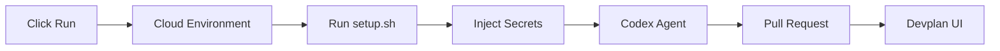
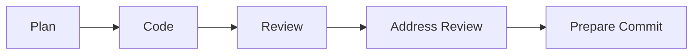

# Run Button

:::note
Run is currently in beta.
:::

The Run Button executes your task implementations in the cloud using a Codex agent. Instead of running AI-assisted coding locally, click **Run** on any task and Devplan handles the entire process — from code generation to Pull Request creation.

---
## Quick Start

1. Configure secrets in **Settings > Development** (if your repo needs credentials)
2. Create `.devplan/run/setup.sh` and commit it to your repository
3. Test via **Settings > Development > Test setup**
4. Click **Run** on any task
---

## How It Works



The agent works through five phases — each visible in the run log:



Run times typically range from 20–60 minutes. Cloud Run automatically retries up to 3 times on agent inactivity or missing output files, resuming from the previous state each time.

---

## Setup Scripts

Create `.devplan/run/setup.sh` in your repository to prepare the cloud environment before the agent starts work. Common uses: installing dependencies, configuring language versions, setting up database connections for tests, and accessing private package registries.

```bash
#!/bin/bash
set -e

npm ci

echo "DATABASE_URL=$DATABASE_TEST_URL" >> "$DEVPLAN_ENV"
echo "NODE_ENV=test" >> "$DEVPLAN_ENV"
```

Make the script executable with `chmod +x .devplan/run/setup.sh`. Test it before running real tasks via **Settings > Development > Test setup**.

---

## Secrets

Store credentials in **Settings > Development > Secrets**. Secrets are encrypted at rest, never shown in the UI after creation, automatically redacted from logs, and injected as environment variables at run time.

Use uppercase names with underscores (`DATABASE_TEST_URL`, `GITHUB_TOKEN`, `AWS_ACCESS_KEY_ID`). Reference them in your setup script as standard environment variables.

:::warning
Deleting a secret will cause any runs that depend on it to fail. Verify nothing active relies on it first.
:::

---

## Monitoring Runs

After clicking **Run**, the button becomes a live status indicator. Click it to open the **Runs page** showing run history with status, duration, and PR links. Click any run to view live logs broken down by phase.

Cloud Run automatically retries up to 3 times on agent inactivity or missing output files, resuming from the previous state each time.

---

## Addressing PR Comments

After the agent creates a PR, reviewers can leave comments as normal. To have the agent address them automatically, leave a comment with your configured trigger keyword:

```
/devplan address comments
```

Configure the trigger keyword in **Settings > Development > Pull Request Comment Trigger**. Leave all review comments before triggering — the agent reads everything unresolved and pushes fixes as a new commit.

---


Questions: [info@devplan.com](mailto:info@devplan.com)

Questions: [info@devplan.com](mailto:info@devplan.com)
