# Core Workflow Guide

*8 min read • Step-by-step walkthrough of Devplan's intelligent workflow*

Devplan transforms how product and engineering teams collaborate by maintaining context throughout the entire development lifecycle. This guide walks you through the complete workflow with practical examples and real CLI interactions.

## Overview: From Idea to Code

```mermaid
graph TD
    A[💡 Idea Input] --> B[🤖 Context Processing]
    B --> C[📋 Agent-Guided Planning]
    C --> D[📝 PRD Generation]
    D --> E[🔧 Technical Design]
    E --> F[📊 User Stories & Tasks]
    F --> G[🔗 Linear/Jira Sync]
    G --> H[⚡ AI Coding Prompts]
    H --> I[💻 IDE Integration]
    I --> J[🚀 Production Code]

    style A fill:#e1f5fe
    style J fill:#e8f5e8
```



## Step 1: Input and Context Processing

### Starting Points
Devplan accepts various input formats to begin the planning process:

**📝 Text Inputs:**
- Quick feature ideas or requests
- Customer feedback and bug reports
- Existing specifications or documentation
- User stories or epics from other tools

**🎨 Visual Inputs:**
- UX mockups and design files
- User flow diagrams
- Architecture sketches

**📊 Data Inputs:**
- Analytics insights
- Customer interview notes
- Market research findings

### Context Engine Processing

Behind the scenes, Devplan's Context Engine analyzes:


**What Gets Analyzed:**
- **Codebase Architecture**: Existing patterns, frameworks, and technical decisions
- **Product Context**: Current features, user flows, and business logic
- **Team Standards**: Coding conventions, review processes, and documentation styles
- **Historical Decisions**: Past project learnings and architectural choices

## Step 2: Agent-Guided Discovery

### Intelligent Questioning
Devplan's Planning Agent doesn't just accept your input—it actively helps you think through the requirements by asking targeted questions based on your codebase analysis and project context.

:::tip What Makes This Different
**Context-Aware Questions:** Unlike generic planning tools, Devplan knows your tech stack, existing patterns, and architectural decisions, so it asks relevant questions that matter for your specific implementation.
:::

### Real Discovery Session Example

**Initial Input:** "Add user authentication to our SaaS dashboard"

**Agent Discovery Process:**

**🔍 Context Analysis (Automatic)**
```
Analyzing codebase...
✓ Detected: Next.js 14 with App Router
✓ Database: PostgreSQL with Prisma
✓ Existing: Basic user model in schema
✓ UI Library: Tailwind + Shadcn components
```

**🤖 Agent Questions:**
1. "I see you have a basic User model. Do you want email/password auth, OAuth (Google/GitHub), or both?"
2. "Your app uses Prisma. Should we extend the existing User schema or create separate auth tables?"
3. "I notice you're using Shadcn components. Should the login form match your existing Button and Input patterns?"
4. "Do you need password reset functionality, and should it integrate with your existing email system?"
5. "Should authenticated routes redirect to a specific dashboard page, or stay on the current page?"

**📝 Collaborative Refinement:**
- PM clarifies business requirements
- Agent suggests technical approaches based on existing code
- Team discusses integration points and edge cases
- Final requirements capture both business and technical needs

:::note Why This Works
This collaborative process typically uncovers 3-5 critical requirements that would otherwise be discovered during implementation, preventing costly rework.
:::

## Step 3: PRD Generation

### Intelligent Document Creation
Based on the discovery session, Devplan generates a comprehensive Product Requirements Document (PRD) that includes:

**📋 Standard PRD Sections:**
- Executive summary and goals
- User stories and acceptance criteria
- Success metrics and KPIs
- Technical requirements and constraints

**🔍 Context-Enhanced Content:**
- Integration points with existing systems
- Code architecture recommendations
- Specific implementation considerations
- Risk assessment and mitigation strategies

### AI Review Process
Devplan's Review Agent acts as your personal Chief Product Officer, analyzing the generated PRD for:

- **Completeness**: Are all aspects of the feature covered?
- **Clarity**: Can engineers implement this without additional clarification?
- **Feasibility**: Are the requirements technically achievable?
- **Alignment**: Does this fit with existing product strategy and architecture?

## Step 4: Technical Design & Architecture

### Code-Aware Planning
Unlike generic planning tools, Devplan understands your technical stack and generates implementation guidance that considers:

**🏗️ Architecture Integration:**
- How new code fits into existing modules
- Database schema changes required
- API endpoints that need modification
- Dependencies and service interactions

**⚙️ Technical Specifications:**
- Component structure and hierarchy
- State management requirements
- Testing strategy and coverage
- Performance considerations

### Example Technical Breakdown

For the dark mode feature:
```
Components to Modify:
├── ThemeProvider.tsx (extend theme context)
├── SettingsPage.tsx (add toggle component)
├── Header.tsx (apply theme classes)
├── Sidebar.tsx (apply theme classes)
└── 12 additional UI components

New Utilities Needed:
├── useTheme() hook
├── ThemeToggle component
└── localStorage persistence layer

Database Changes:
└── user_preferences.theme_mode (varchar)
```

## Step 5: User Stories & Task Breakdown

### Automated Story Generation
Devplan breaks down features into implementation-ready user stories with context-aware estimates based on your actual codebase complexity.

### Real User Stories Example

**From: "User Authentication Feature"**

:::note Generated Stories

**Story 1: User Registration Form**
```markdown
**As a** new user
**I want** to create an account with email and password
**So that** I can access the SaaS dashboard

**Acceptance Criteria:**
- Registration form with email, password, confirm password fields
- Real-time validation using existing Zod schemas
- Password strength indicator
- Email uniqueness validation
- Success state redirects to dashboard
- Error handling for duplicate emails
- Form follows existing Shadcn UI patterns
- Accessible form labels and error messages

**Technical Requirements:**
- Extend User model in Prisma schema
- Create server action for user creation
- Hash passwords using bcrypt
- Integrate with existing form validation patterns

**Files to Modify:**
- `prisma/schema.prisma` (User model)
- `src/app/(auth)/register/page.tsx` (new)
- `src/components/auth/RegisterForm.tsx` (new)
- `src/lib/actions/auth.ts` (new)

**Estimate:** 6 hours | AI Complexity: Medium
**Dependencies:** Database schema update, email validation service
```

**Story 2: Login Form**
```markdown
**As a** returning user
**I want** to log in with my credentials
**So that** I can access my dashboard

**Acceptance Criteria:**
- Login form with email and password
- "Remember me" checkbox for persistent sessions
- "Forgot password" link
- Invalid credential error handling
- Rate limiting for failed attempts
- Redirect to intended page after login

**Technical Requirements:**
- Session management with NextAuth or similar
- Credential validation against database
- Secure session storage
- Integration with middleware for protected routes

**Estimate:** 4 hours | AI Complexity: Low
**Dependencies:** Story 1 (User Registration)
```

**Story 3: Protected Route Middleware**
```markdown
**As a** system
**I want** to protect authenticated routes
**So that** only logged-in users can access the dashboard

**Acceptance Criteria:**
- Middleware checks authentication status
- Unauthenticated users redirect to login
- Authenticated users can access protected pages
- Login page redirects authenticated users to dashboard

**Estimate:** 3 hours | AI Complexity: Low
```
:::

**Total Feature Estimate:** 13 hours across 3 stories
**Recommended Sprint Allocation:** 1-2 sprints depending on team capacity

## Step 6: Integration with Project Management

### Seamless Sync to Your Tools

**Linear Integration Results:**

When Devplan syncs with Linear, it creates a complete project structure:
- **Epic Creation:** Main feature becomes a Linear epic with full context
- **Story Breakdown:** Individual user stories become properly formatted tickets
- **Time Estimates:** Each ticket includes time estimates and complexity ratings
- **Context Links:** Every ticket links back to original requirements and technical specs
- **Technical Details:** Implementation notes and file references included
- **Acceptance Criteria:** Detailed acceptance criteria for each story

**Jira Integration Results:**

For Jira workspaces, Devplan creates a structured hierarchy:
- **Epic Management:** Complex features become properly structured epics
- **Story Points:** Automatic story point assignment based on complexity
- **Sprint Assignment:** Stories assigned to sprints based on team capacity
- **Label Application:** Automatic tagging with relevant labels (frontend, backend, etc.)
- **Custom Fields:** Devplan data maps to your existing Jira custom fields
- **Workflow Integration:** Stories follow your established Jira workflows

:::tip Context Preservation
**Smart Linking:** Every ticket maintains a link back to:
- Original feature requirements
- Technical design decisions
- AI-generated implementation prompts
- Related tickets and dependencies

This ensures developers always have full context, even weeks later.
:::

## Step 7: AI Coding Prompts

### Context-Rich Prompt Generation
This is where Devplan's context engine really shines. Instead of generic prompts, you get:

**🎯 Specific Implementation Guidance:**
- Exact file paths and component names
- Integration points with existing code
- Code patterns and conventions to follow
- Error handling and edge case considerations

### Real AI Coding Prompt Example

**Generated for: User Authentication Feature**

````markdown
## Implement User Registration and Login Components

**Context:** Adding authentication to Next.js 14 SaaS dashboard with existing Prisma setup and Shadcn UI components.

**Files to Create/Modify:**
```
src/app/(auth)/
├── login/page.tsx          # Login page
├── register/page.tsx       # Registration page
└── layout.tsx             # Auth layout

src/components/auth/
├── LoginForm.tsx          # Main login form
├── RegisterForm.tsx       # Registration form
└── AuthButton.tsx         # Reusable auth button

src/lib/
└── auth.ts               # Auth utilities
```

**Implementation Requirements:**
1. **Form Components**: Use existing form patterns from `src/components/ui/form.tsx` and `src/lib/validations.ts`
2. **Database Integration**: Extend existing User model in `prisma/schema.prisma` with auth fields
3. **UI Consistency**: Follow button patterns from `src/components/ui/button.tsx` and input styling from `src/components/ui/input.tsx`
4. **Error Handling**: Use existing toast system from `src/components/ui/use-toast.ts`

**Code Patterns to Follow:**
```typescript
// Follow existing form validation pattern
import { z } from "zod"
import { useForm } from "react-hook-form"
import { zodResolver } from "@hookform/resolvers/zod"

// Use established server action pattern
import { createUser } from "@/lib/actions/user"

// Follow existing error handling
import { toast } from "@/components/ui/use-toast"
```

**Integration Points:**
- Integrate with existing middleware pattern in `middleware.ts`
- Use current database connection from `lib/db.ts`
- Follow existing API route structure in `app/api/`
- Maintain accessibility standards with proper ARIA labels

**Testing Requirements:**
- Unit tests following patterns in `__tests__/components/`
- Integration tests for auth flow
- Form validation edge cases

**Acceptance Criteria:**
- [ ] Users can register with email/password
- [ ] Login form validates and authenticates users
- [ ] Error states are handled gracefully
- [ ] Forms are accessible (keyboard navigation, screen readers)
- [ ] UI matches existing design system
````

## Step 8: CLI Integration

### Direct IDE Integration
Devplan's CLI tool integrates project management with local AI-powered IDEs:

**⚡ Core Commands:**
```bash
# Focus on a specific feature in your current repository
devplan focus

# Focus with specific IDE integration
devplan focus --ide cursor

# Clone repository and focus on feature
devplan clone --repo repository-name
```

**🔧 IDE Integration:**
- Automatic context file generation for AI assistants
- Support for multiple IDE platforms
- Repository and feature context preservation
- Seamless workflow integration

### Real Development Flow

**Starting Development with Rich Context:**

```bash
# Navigate to your project
$ cd my-saas-app

# Focus on the authentication feature
$ devplan focus --ide cursor

✓ Connecting to Devplan...
✓ Loading project context...
✓ Analyzing repository structure...
✓ Retrieving feature requirements...
✓ Generating IDE context files...

📋 Feature: User Authentication System
📁 Context files created:
   • .cursorrules (Cursor AI configuration)
   • .devplan/context.md (Feature context)
   • .devplan/requirements.md (Detailed specs)
   • .devplan/architecture.md (Technical guidance)

🚀 Opening Cursor with enhanced context...
```

**What Your AI Assistant Now Knows:**

```markdown
# Auto-generated context for Cursor AI

## Project Context
- Next.js 14 app with App Router
- PostgreSQL + Prisma ORM
- Tailwind CSS + Shadcn UI
- TypeScript throughout

## Current Task
Implement user authentication (login/register)
with email/password and session management.

## Code Patterns to Follow
- Server Actions for form handling
- Zod for validation schemas
- React Hook Form for form state
- Shadcn components for UI

## Files to Reference
- /src/components/ui/* (existing UI components)
- /src/lib/validations.ts (validation patterns)
- /prisma/schema.prisma (database schema)
```

:::tip Pro Tip
With this rich context, your AI assistant can now generate code that actually fits your project instead of generic examples!
:::

## Step 9: Status Reporting & Monitoring

### Automated Progress Tracking
Devplan monitors development progress and provides real-time updates:

**📊 Progress Metrics:**
- Story completion rates
- Time to completion vs. estimates
- Code quality indicators
- Integration success rates

**🚨 Risk Detection:**
- Scope creep identification
- Timeline deviation alerts
- Dependency blocking issues
- Quality regression warnings

## Best Practices for Success

### 👩‍💼 For Product Managers

**During Discovery:**
- ✅ **Provide Rich Context**: Include user research, analytics, and business goals
- ✅ **Embrace AI Questions**: Let the agent help you think through edge cases
- ✅ **Review Generated PRDs**: Use the AI review process to catch gaps
- ✅ **Link Related Features**: Connect to existing user flows and features

**Common Mistakes to Avoid:**
- ❌ Rushing through discovery phase
- ❌ Skipping technical collaboration
- ❌ Not updating requirements when scope changes

### 👨‍💻 For Engineers

**During Implementation:**
- ✅ **Trust the Context**: AI prompts include architectural decisions and patterns
- ✅ **Update Estimates**: Provide feedback when actual time differs from estimates
- ✅ **Use CLI Workflow**: `devplan focus` saves 15-30 minutes per feature
- ✅ **Document Learnings**: Share discoveries that could improve future estimates

**Pro Tips:**
```bash
# Always start with context loading
devplan focus --ide cursor

# Review requirements before coding
cat .devplan/requirements.md

# Check architectural guidance
cat .devplan/architecture.md
```

### 🤝 For Teams

**Workflow Integration:**
- **Sprint Planning**: Use Devplan estimates as starting point for capacity planning
- **Daily Standups**: Reference ticket links for quick context sharing
- **Retrospectives**: Review estimate accuracy and process improvements
- **Knowledge Sharing**: Update coding standards and patterns in Devplan

**Success Metrics to Track:**
| Metric | Target | How to Measure |
|--------|--------|----------------|
| Planning Time | 80% reduction | Compare pre/post Devplan planning sessions |
| Estimate Accuracy | ±20% of actual | Track story completion times vs estimates |
| Rework Rate | `<10%` | Measure tickets that need significant changes |
| Context Clarity | >90% | Survey: "Did you have enough context to implement?" |

## Troubleshooting Common Issues

### 🔧 Context and AI Issues

**Problem:** AI prompts seem generic or miss important context
```bash
# Check repository analysis status
devplan repo status

# Re-analyze if needed
devplan repo refresh

# Verify integration
devplan auth status
```

**Problem:** Estimates don't match team velocity
```markdown
# In your completed tickets, add feedback:
"Actual time: 8 hours (estimated 4 hours)
Reason: Needed to refactor existing auth service"

# System learns from this feedback for future estimates
```

### 🔗 Integration Issues

**Linear/Jira Sync Problems:**

**Check Integration Status:**
```bash
# Verify connection
devplan integrations list

# Test sync
devplan sync --dry-run

# Full resync if needed
devplan sync --force
```

**Common Fixes:**
- ✅ Verify API permissions in Linear/Jira
- ✅ Check webhook URLs are accessible
- ✅ Ensure project mapping is correct
- ✅ Validate user permissions for ticket creation

### 💻 CLI and Development Issues

**CLI Not Working:**
```bash
# Check authentication
devplan auth status

# Re-authenticate if needed
devplan logout && devplan login

# Verify project linking
devplan project info

# Check you're in correct directory
pwd  # Should be in your project root
```

**IDE Context Not Loading:**
```bash
# Verify context files were created
ls .devplan/

# Regenerate if missing
devplan focus --force

# Check IDE-specific files
ls .cursorrules  # For Cursor
ls .claude/     # For Claude Code
```

:::warning Get Help
**Still having issues?**
- 📧 Email: support@devplan.com
- 💬 Slack: [Community Slack]
- 📖 Docs: /troubleshooting (detailed guide)
:::

## Next Steps

### 🚀 Ready to Try This Workflow?

**For New Users:**
1. **[Set up your account](/getting-started)** - 15 minute setup process
2. **Connect your first repository** - Start with a small project
3. **Create your first feature** - Follow this exact workflow
4. **Experience the difference** - See context-driven development in action

**For Teams:**
1. **Start with a pilot project** - Pick one feature to test the workflow
2. **Include both PM and engineering** - Collaborative approach works best
3. **Measure the results** - Track time savings and quality improvements
4. **Scale gradually** - Expand to more projects as team adopts workflow

### 📚 Learn More

- **[Getting Started Guide](/getting-started)** - Complete setup instructions
- **[Architecture Overview](/architecture)** - Technical deep dive
- **[Value Proposition](/value-proposition)** - Business case and ROI

**Questions?** Join our community or contact support at info@devplan.com