# Core Workflow Guide

Devplan transforms how product and engineering teams collaborate by maintaining context throughout the entire development lifecycle. This guide walks you through the complete workflow, from initial idea to production code.

## Overview: From Idea to Code

```mermaid
graph TD
    A[💡 Idea Input] --> B[🤖 Context Processing]
    B --> C[📋 Agent-Guided Planning]
    C --> D[📝 PRD Generation]
    D --> E[🔧 Technical Design]
    E --> F[📊 User Stories & Tasks]
    F --> G[🔗 Linear/Jira Sync]
    G --> H[⚡ AI Coding Prompts]
    H --> I[💻 IDE Integration]
    I --> J[🚀 Production Code]

    style A fill:#e1f5fe
    style J fill:#e8f5e8
```



## Step 1: Input and Context Processing

### Starting Points
Devplan accepts various input formats to begin the planning process:

**📝 Text Inputs:**
- Quick feature ideas or requests
- Customer feedback and bug reports
- Existing specifications or documentation
- User stories or epics from other tools

**🎨 Visual Inputs:**
- UX mockups and design files
- User flow diagrams
- Architecture sketches

**📊 Data Inputs:**
- Analytics insights
- Customer interview notes
- Market research findings

### Context Engine Processing

Behind the scenes, Devplan's Context Engine analyzes:


**What Gets Analyzed:**
- **Codebase Architecture**: Existing patterns, frameworks, and technical decisions
- **Product Context**: Current features, user flows, and business logic
- **Team Standards**: Coding conventions, review processes, and documentation styles
- **Historical Decisions**: Past project learnings and architectural choices

## Step 2: Agent-Guided Discovery

### Intelligent Questioning
Devplan's Planning Agent doesn't just accept your input—it actively helps you think through the requirements by asking targeted questions based on:

- **Project Complexity**: Automatically sizes the scope and determines the depth of questioning needed
- **Missing Context**: Identifies gaps in requirements that could lead to implementation issues
- **Integration Points**: Understands how the new feature connects to existing systems
- **User Impact**: Considers the customer journey and business impact

### Example Discovery Session

**Initial Input:** "Add a dark mode toggle to the settings page"

**Agent Questions:**
1. "I see you want to add dark mode. Should this be a user preference that persists across sessions?"
2. "Looking at your current architecture, I notice you're using CSS-in-JS. Should we extend your existing theme system or create a new approach?"
3. "I found 15 components that would need theme support. Should we implement this globally or start with core components?"
4. "Your analytics show 40% mobile usage. How should the toggle work on mobile devices?"

### Collaborative Refinement
This back-and-forth refinement process is often cited by users as the most valuable part of Devplan—turning vague ideas into crystal-clear requirements.

## Step 3: PRD Generation

### Intelligent Document Creation
Based on the discovery session, Devplan generates a comprehensive Product Requirements Document (PRD) that includes:

**📋 Standard PRD Sections:**
- Executive summary and goals
- User stories and acceptance criteria
- Success metrics and KPIs
- Technical requirements and constraints

**🔍 Context-Enhanced Content:**
- Integration points with existing systems
- Code architecture recommendations
- Specific implementation considerations
- Risk assessment and mitigation strategies

### AI Review Process
Devplan's Review Agent acts as your personal Chief Product Officer, analyzing the generated PRD for:

- **Completeness**: Are all aspects of the feature covered?
- **Clarity**: Can engineers implement this without additional clarification?
- **Feasibility**: Are the requirements technically achievable?
- **Alignment**: Does this fit with existing product strategy and architecture?

## Step 4: Technical Design & Architecture

### Code-Aware Planning
Unlike generic planning tools, Devplan understands your technical stack and generates implementation guidance that considers:

**🏗️ Architecture Integration:**
- How new code fits into existing modules
- Database schema changes required
- API endpoints that need modification
- Dependencies and service interactions

**⚙️ Technical Specifications:**
- Component structure and hierarchy
- State management requirements
- Testing strategy and coverage
- Performance considerations

### Example Technical Breakdown

For the dark mode feature:
```
Components to Modify:
├── ThemeProvider.tsx (extend theme context)
├── SettingsPage.tsx (add toggle component)
├── Header.tsx (apply theme classes)
├── Sidebar.tsx (apply theme classes)
└── 12 additional UI components

New Utilities Needed:
├── useTheme() hook
├── ThemeToggle component
└── localStorage persistence layer

Database Changes:
└── user_preferences.theme_mode (varchar)
```

## Step 5: User Stories & Task Breakdown

### Automated Story Generation
Devplan breaks down the feature into implementation-ready user stories, each containing:

**📝 User Story Structure:**
- **As a** [user type]
- **I want** [functionality]
- **So that** [business value]

**✅ Acceptance Criteria:**
- Specific, testable conditions
- Edge cases and error handling
- Cross-browser/device compatibility

**⏱️ Time & Complexity Estimates:**
- Development time estimation
- AI implementation complexity rating
- Dependencies and blockers

### Example User Stories

```markdown
## Story 1: Theme Toggle Component
**As a** user
**I want** a dark mode toggle in the settings page
**So that** I can switch between light and dark themes

**Acceptance Criteria:**
- Toggle appears in Settings → Appearance section
- Changes are applied immediately without page refresh
- Selection persists across browser sessions
- Works on desktop and mobile interfaces

**Estimate:** 4 hours | AI Complexity: Low
```

## Step 6: Integration with Project Management

### Seamless Sync
Devplan integrates with your existing workflow tools:

**📊 Linear Integration:**
- Automatic ticket creation
- Maintains story relationships
- Syncs status updates
- Preserves context links

**🎯 Jira Integration:**
- Epic and story hierarchy
- Custom field mapping
- Sprint planning support
- Automated transitions

### Maintaining Context Links
Each ticket includes links back to the original PRD and technical design, ensuring context is never lost during implementation.

## Step 7: AI Coding Prompts

### Context-Rich Prompt Generation
This is where Devplan's context engine really shines. Instead of generic prompts, you get:

**🎯 Specific Implementation Guidance:**
- Exact file paths and component names
- Integration points with existing code
- Code patterns and conventions to follow
- Error handling and edge case considerations

### Example AI Coding Prompt

```markdown
## Implement Dark Mode Toggle Component

**Context:** Building a theme toggle for the settings page in a React app using styled-components and Context API.

**Files to Modify:**
- `src/contexts/ThemeContext.tsx` - extend with dark mode state
- `src/components/settings/AppearanceSettings.tsx` - add toggle component
- `src/styles/themes.ts` - define dark theme colors

**Implementation Requirements:**
1. Use existing Button component pattern from `src/components/ui/Button.tsx`
2. Follow the toggle pattern established in `NotificationSettings.tsx`
3. Persist selection in localStorage using existing `useLocalStorage` hook
4. Apply theme classes using the `useTheme` pattern from navigation components

**Integration Points:**
- Theme context must work with existing Header and Sidebar components
- Ensure compatibility with current CSS-in-JS setup
- Maintain accessibility standards (ARIA labels, keyboard navigation)

**Code Patterns to Follow:**
[Include specific code examples from the existing codebase]
```

## Step 8: CLI Integration

### Direct IDE Integration
Devplan's CLI tool integrates project management with local AI-powered IDEs:

**⚡ Core Commands:**
```bash
# Focus on a specific feature in your current repository
devplan focus

# Focus with specific IDE integration
devplan focus --ide cursor

# Clone repository and focus on feature
devplan clone --repo repository-name
```

**🔧 IDE Integration:**
- Automatic context file generation for AI assistants
- Support for multiple IDE platforms
- Repository and feature context preservation
- Seamless workflow integration

### Development Flow
```bash
# Focus on your current feature
$ devplan focus --ide cursor

> Repository context loaded
> Feature requirements prepared
> IDE context files generated
> Ready to start coding with AI!

# Your AI coding assistant now has rich context about:
# - Your codebase structure and patterns
# - Feature requirements and specifications
# - Integration points and dependencies
```

## Step 9: Status Reporting & Monitoring

### Automated Progress Tracking
Devplan monitors development progress and provides real-time updates:

**📊 Progress Metrics:**
- Story completion rates
- Time to completion vs. estimates
- Code quality indicators
- Integration success rates

**🚨 Risk Detection:**
- Scope creep identification
- Timeline deviation alerts
- Dependency blocking issues
- Quality regression warnings

## Best Practices for Success

### For Product Managers
1. **Start with Context**: Provide as much background as possible during discovery
2. **Embrace Iteration**: Use the agent's questions to refine your thinking
3. **Review Thoroughly**: Take advantage of the AI review process
4. **Maintain Links**: Keep the connection between requirements and implementation visible

### For Engineers
1. **Trust the Context**: The prompts contain valuable architectural context
2. **Provide Feedback**: Update the system when estimates are off
3. **Use the CLI**: Integrate Devplan into your daily development workflow
4. **Share Learnings**: Document decisions and patterns for future projects

### For Teams
1. **Collaborative Discovery**: Include both PM and engineering perspectives during planning
2. **Regular Sync**: Use Devplan's status reports for standup updates
3. **Continuous Improvement**: Refine templates and processes based on what works
4. **Context Maintenance**: Keep company documentation and standards up to date

## Troubleshooting Common Issues

### Context Not Loading
- **Issue**: AI prompts seem generic or miss important context
- **Solution**: Ensure GitHub integration is properly configured and repositories are analyzed

### Estimates Seem Off
- **Issue**: Time estimates don't match your team's velocity
- **Solution**: Provide feedback on completed stories to improve future estimates

### Integration Problems
- **Issue**: Linear/Jira sync not working properly
- **Solution**: Check permissions and webhook configurations in integration settings

### CLI Not Working
- **Issue**: `devplan` commands not pulling correct context
- **Solution**: Verify you're in the correct project directory and authentication is set up

## Next Steps

Ready to start using Devplan? Check out our [Getting Started Guide](/getting-started) for setup instructions and your first project walkthrough.