# Core Workflow: Context-Driven Development

## The Journey from Idea to Implementation

**Let's follow a real example:** Your product team wants to add a "Smart Recommendations" feature to your e-commerce platform. Here's how Devplan transforms this idea into high-quality, contextual implementation while preserving every decision along the way.

## Overview: The Information Evolution

Traditional development workflows lose context at every handoff. Devplan's workflow **accumulates and preserves** context, making each stage more informed than the last.

**What makes this different:** Instead of starting fresh at each stage, every step builds on rich, structured context from previous stages. By the time engineers start coding, they have the complete picture—not just technical requirements, but business rationale, user research insights, and strategic constraints.

## The Context Flow Diagram

```mermaid
flowchart TD
    IDEA["💡 Product Idea<br/>Smart Recommendations"]
    PRD["📋 Structured Requirements<br/>• User personas<br/>• Success metrics<br/>• Business constraints"]
    TECH["🏗️ Technical Architecture<br/>• System design<br/>• Data requirements<br/>• Performance targets"]
    BUILD["📊 Implementation Plan<br/>• User stories<br/>• Task breakdown<br/>• Timeline estimates"]
    AI["🤖 Development Context<br/>• AI prompts<br/>• Code patterns<br/>• Business rules"]
    CLI["💻 IDE Integration<br/>• Complete project context<br/>• AI assistant setup<br/>• Development environment"]
    CODE["✨ Implementation<br/>• Context-aware coding<br/>• Requirement traceability<br/>• Quality assurance"]

    IDEA -->|"Business goals & user needs"| PRD
    PRD -->|"Structured requirements & constraints"| TECH
    TECH -->|"Technical decisions & architecture"| BUILD
    BUILD -->|"Detailed tasks & acceptance criteria"| AI
    AI -->|"Context-rich prompts & patterns"| CLI
    CLI -->|"Complete development context"| CODE

    CODE -.->|"Implementation learnings"| BUILD
    BUILD -.->|"Technical feasibility feedback"| TECH
    TECH -.->|"Constraint validation"| PRD

    style IDEA fill:#fff2e6
    style PRD fill:#e1f5fe
    style TECH fill:#f3e5f5
    style BUILD fill:#e8f5e8
    style AI fill:#fff3e0
    style CLI fill:#fce4ec
    style CODE fill:#e3f2fd
```

**Key Insight:** Notice the feedback loops (dotted lines). Context doesn't just flow forward—implementation discoveries inform earlier stages, creating a learning cycle that improves future projects.

## Stage 1: Structured Requirements Capture

### Why This Stage Matters
**Traditional Problem:** Product requirements are scattered across emails, Slack messages, and meeting notes. Engineers get fragmented information and must guess at missing context.

**Devplan Solution:** Structured templates capture complete business context in AI-friendly formats that flow through the entire development cycle.

### Following Our Example: Smart Recommendations Feature

**Business Context Captured:**
- **User Research:** 67% of users abandon cart due to decision paralysis
- **Success Metrics:** Increase conversion rate by 15%, reduce cart abandonment by 25%
- **Strategic Constraints:** Must integrate with existing analytics, privacy-compliant data usage
- **Competitive Context:** Competitor X launched similar feature, but users complain it's "creepy"

### How to Use This Stage

1. **Start with Template Selection**
   - Choose "E-commerce Feature" template (pre-built for your domain)
   - Template automatically prompts for user research, metrics, constraints

2. **Collaborate on Context**
   - Product manager adds business goals and success metrics
   - UX designer attaches user research and interaction flows
   - Engineering lead adds technical constraints and feasibility notes

3. **Structure the Information**
   - **User Personas:** Detailed descriptions with pain points and motivations
   - **Acceptance Criteria:** Specific, testable conditions for success
   - **Business Rules:** Edge cases, privacy requirements, performance expectations
   - **Success Metrics:** How you'll measure feature effectiveness

### Context Preservation Magic
**Traditional Workflow:** Business context gets summarized into brief engineering tickets
**Devplan Workflow:** Complete business context flows to implementation—AI assistants understand why features exist, not just what to build

**Concrete Example:**
- Traditional ticket: "Add product recommendations to cart page"
- Devplan context: AI assistant knows the feature should reduce decision paralysis (not maximize revenue), must respect privacy constraints, and should feel helpful (not manipulative)

### Best Practices for Maximum Context Capture

**Complete the Business Picture:**
- Link to user research studies and interview transcripts
- Include competitive analysis and market positioning
- Document strategic constraints and compliance requirements
- Attach mockups with detailed interaction annotations

**Make Context AI-Friendly:**
- Use structured fields rather than free-form text
- Include explicit business rules and edge cases
- Document the "why" behind each requirement
- Add examples of desired and undesired outcomes

*The structured PRD captures complete business context that flows through the entire development cycle*

## Stage 2: Technical Architecture with Business Alignment

### Why This Stage Matters
**Traditional Problem:** Technical designs focus on implementation without preserving business rationale. Engineers build technically correct solutions that miss business intent.

**Devplan Solution:** Technical decisions remain linked to business requirements. Implementation choices carry forward the "why" along with the "how."

### Following Our Example: Architecture Decisions

**Technical Context Created:**
- **Data Pipeline:** Real-time user behavior analysis with privacy-preserving aggregation
- **Performance Requirements:** &lt;200ms recommendation generation, handles 1000 concurrent users
- **Integration Architecture:** Connects to existing analytics (preserving user research insights) and inventory systems
- **Privacy Implementation:** On-device computation for sensitive data, aggregate patterns only

### Context Evolution in This Stage

**Input from Stage 1:** Business requirements and user research insights
**Added Context:** Technical constraints, system architecture, implementation approach
**Preserved Context:** Every technical decision links back to business requirements

**Example of Context Preservation:**
- Business requirement: "Recommendations should feel helpful, not manipulative"
- Technical translation: "Use collaborative filtering (not profit-maximizing algorithms), show reasoning to users, allow easy dismissal"
- Implementation detail: "Include 'why we recommend this' explanations in API response"

### How to Use This Stage

1. **Start from Linked PRD**
   - Technical design document automatically inherits PRD context
   - Links to specific requirements remain active throughout development

2. **Make Architecture Decisions with Business Context**
   - Each technical choice references specific business requirements
   - Alternative approaches are evaluated against user research findings
   - Performance targets connect to success metrics from Stage 1

3. **Document Decision Rationale**
   - Why this architecture supports business goals
   - How technical constraints influence user experience
   - Where business requirements drive implementation choices

### Technical Context That Flows Forward

**System Architecture:** High-level design with component interactions
**Data Flow:** How information moves through the system
**Performance Targets:** Specific requirements tied to user experience goals
**Integration Points:** How new feature connects to existing systems
**Business Logic:** Rules and algorithms that implement product requirements

*Technical decisions remain linked to business requirements throughout the development cycle*

## Stage 3: Implementation Planning with Context Inheritance

### Why This Stage Matters
**Traditional Problem:** User stories lose connection to original business goals. Engineers implement features correctly but miss subtle requirements that matter to users.

**Devplan Solution:** Implementation tasks inherit full context from requirements and technical design. Every task carries forward the complete picture.

### Following Our Example: Breaking Down Implementation

**Generated User Stories with Rich Context:**

**Story 1:** "Recommendation Engine API"
- **Inherited Business Context:** Must feel helpful (not manipulative), respect privacy
- **Inherited Technical Context:** &lt;200ms response time, collaborative filtering approach
- **Implementation Context:** Specific API endpoints, data structures, testing criteria

**Story 2:** "Frontend Recommendation Display"
- **Inherited Business Context:** Reduce decision paralysis, allow easy dismissal
- **Inherited Technical Context:** Real-time updates, mobile-responsive design
- **Implementation Context:** UI components, interaction patterns, accessibility requirements

### Context Mapping Process

**Automatic Inheritance:** User stories automatically include relevant context from previous stages
**Traceability Links:** Every implementation task connects back to specific business requirements
**Context Filtering:** Each story gets the context relevant to its scope (not overwhelming detail)

### How to Use This Stage

1. **Generate Context-Rich User Stories**
   - AI agents analyze PRD and technical design to create comprehensive stories
   - Each story includes business rationale, technical constraints, and acceptance criteria
   - Stories maintain links back to original requirements

2. **Organize by Implementation Logic**
   - Group related stories into logical development phases
   - Identify dependencies based on technical architecture
   - Plan rollout strategy that validates business assumptions early

3. **Add Implementation-Specific Context**
   - Development estimates based on technical complexity
   - Testing strategies that validate business requirements
   - Deployment considerations that maintain user experience

### Context That Flows to Development

**Complete User Stories:** Not just "what to build" but "why it matters"
**Technical Specifications:** Detailed implementation guidance
**Business Validation:** How to test that implementation meets user needs
**Edge Case Handling:** Corner cases derived from business requirements
**Success Criteria:** Specific, measurable outcomes for each story

*Implementation plan maintains connection to business goals while providing technical clarity*

## Stage 4: AI-Optimized Development Context

### Why This Stage Matters
**Traditional Problem:** AI coding assistants work with limited context—just the immediate code and a brief description. They miss business nuance and make technically correct but strategically wrong decisions.

**Devplan Solution:** AI assistants receive rich, structured context that includes business goals, user research insights, technical constraints, and implementation history.

### Following Our Example: Context for AI Assistants

**Rich Prompt Context for Recommendations Feature:**
- **Business Goal:** Reduce cart abandonment by helping users make confident decisions
- **User Research:** Users want to understand why items are recommended
- **Technical Constraints:** Must work with existing analytics infrastructure
- **Code Patterns:** Follow established patterns from authentication and checkout features
- **Privacy Requirements:** Use on-device computation for sensitive data

### AI Agent Capabilities with Full Context

**Contextual Code Generation:**
- Understands business requirements, not just technical specifications
- Follows established patterns from your existing codebase
- Implements features that align with user research findings
- Generates code that supports business metrics and success criteria

**Business-Aware Decision Making:**
- Chooses algorithms that support business goals (collaborative filtering vs. profit maximization)
- Implements user experience details that matter (recommendation explanations, easy dismissal)
- Handles edge cases based on business requirements (privacy, performance, accessibility)
- Suggests improvements based on complete context understanding

### How to Use This Stage

1. **Generate Development Prompts**
   - AI analyzes complete project context to create comprehensive development prompts
   - Prompts include business rationale, technical constraints, and code patterns
   - Context is optimized for your specific development tools and practices

2. **Customize for Your Workflow**
   - Adapt prompts to your team's coding standards and practices
   - Include references to existing code patterns and architectural decisions
   - Add team-specific context like performance requirements and deployment processes

3. **Maintain Context Connections**
   - Every generated prompt links back to original business requirements
   - Implementation decisions can be traced to specific user research insights
   - Code changes maintain connection to business goals and success metrics

### Context-Rich Development Experience

**Comprehensive Understanding:** AI assistants know why features exist, not just what to implement
**Business Alignment:** Code generation supports user experience goals and business metrics
**Consistency:** New code follows established patterns and architectural decisions
**Quality:** Implementation includes proper error handling, edge cases, and performance considerations

*AI assistants receive complete project context, enabling business-aware code generation*

## Stage 5: Seamless IDE Integration

### Why This Stage Matters
**Traditional Problem:** Moving from planning to implementation requires mental context switching. Engineers must remember or look up business requirements, technical decisions, and project context.

**Devplan Solution:** Complete project context transfers automatically to your development environment. AI assistants work with full knowledge from day one.

### Following Our Example: Development Environment Setup

**Context Transferred to IDE:**
- **Complete Project History:** All decisions, requirements, and technical specifications
- **Business Context:** User research insights, success metrics, strategic constraints
- **Technical Context:** Architecture decisions, performance requirements, integration points
- **Implementation Context:** Code patterns, testing strategies, deployment procedures

### Context Transfer Process

**Automatic Download:** CLI pulls complete project context from Devplan workspace
**AI Assistant Configuration:** Your IDE's AI receives structured prompts with full project knowledge
**Repository Integration:** Existing codebase patterns and architectural decisions are analyzed and included
**Environment Setup:** Development environment configured with project-specific rules and preferences

**Real-World Efficiency Data:**
- **Manual setup (without CLI):** 6-10 repetitive steps per feature - download prompts, clone repos, configure IDE, manage worktrees
- **Devplan CLI:** Single command: `devplan clone -c XX -p YYYY -y -i cursor -f ZZZZ`
- **Time savings:** Setup goes from ~5-10 minutes to ~30 seconds per feature
- **Parallel development:** "Makes scale possible... we can run multiple features in parallel"

### How to Use This Stage

1. **Install and Authenticate CLI**
   - One-time setup connects your development environment to Devplan workspace
   - Secure authentication ensures you access only authorized project context

2. **Focus on Specific Features**
   - Use `devplan focus` to download context for specific user stories or features
   - CLI sets up your IDE with relevant context and coding prompts
   - Environment includes business requirements, technical constraints, and implementation guidance

3. **Develop with Full Context**
   - AI assistants understand complete project background
   - Code generation aligns with business goals and technical architecture
   - Implementation decisions can reference original requirements and user research

### Supported Development Environments

**IDE Integration:**
- **Cursor:** Native integration with context-aware AI assistance
- **VS Code:** Extension provides seamless project context access
- **JetBrains IDEs:** Plugin supports IntelliJ, WebStorm, and other JetBrains tools
- **Windsurf:** Built-in support for Devplan project context

**AI Assistant Enhancement:**
- **Contextual Code Completion:** Suggestions align with business requirements
- **Business-Aware Refactoring:** Improvements that support user experience goals
- **Intelligent Error Detection:** Catches issues that would impact business metrics
- **Pattern Consistency:** Maintains architectural decisions across the codebase

### Development Experience with Full Context

**Business-Aligned Implementation:** Code naturally supports user experience goals and success metrics
**Faster Decision Making:** No need to look up requirements or guess at business intent
**Quality by Default:** Implementation includes proper error handling, edge cases, and performance considerations
**Consistency:** New code follows established patterns and architectural decisions

*CLI seamlessly transfers complete project context to your development environment*

## The Complete Context Flow: What Makes This Different

### Traditional Development Workflow
1. **Requirements:** Brief descriptions in tickets
2. **Design:** Technical specifications without business context
3. **Implementation:** Engineers guess at missing context
4. **Result:** Technically correct but strategically inconsistent features

### Devplan Context-Driven Workflow
1. **Requirements:** Complete business context captured in structured format
2. **Design:** Technical decisions remain linked to business goals
3. **Implementation:** Engineers work with full context understanding
4. **Result:** Features that perfectly align with business intent and user needs

### Context Accumulation vs. Context Loss

**Traditional Approach (Context Loss):**
- Business context → Simplified requirements → Basic technical specs → Minimal implementation context
- Each stage loses information and nuance
- Final implementation often misses subtle but important requirements

**Devplan Approach (Context Accumulation):**
- Business context → Enhanced technical context → Rich implementation context → AI-optimized development
- Each stage adds information while preserving previous context
- Final implementation includes complete understanding of business intent

## Measuring Context-Driven Development Success

### Quality Metrics
- **Requirements Clarification:** 80% reduction in questions during development
- **Feature Iteration:** 60% fewer revisions due to misunderstood requirements
- **User Acceptance:** 90% first-pass acceptance rate for completed features

### Efficiency Metrics
- **Context Reconstruction:** 75% reduction in time spent understanding requirements
- **Implementation Speed:** 40% faster development due to clear guidance
- **Knowledge Transfer:** New team members productive in days, not weeks
- **Course Correction:** Under 2 minutes from identifying AI errors to restarting with corrected requirements

### Business Alignment Metrics
- **Feature Success:** Higher user adoption rates due to better requirement understanding
- **Technical Debt:** Reduced refactoring needs due to consistent implementation
- **Strategic Alignment:** Features that support business goals rather than just technical requirements

### Real-World Production Metrics
*Based on Devplan's own development team using this workflow for 90%+ of shipped code:*
- **Planning efficiency:** 8-10x faster than manual spec/prompt management
- **End-to-end execution:** 2-3x faster overall coding workflow
- **Parallel development:** Multiple AI agents working simultaneously on different features
- **Workflow reliability:** "Fast, consistent, and repeatable" feature execution

## Getting Started with Context-Driven Development

### Phase 1: First Project (Week 1-2)
1. **Choose a Representative Feature:** Pick something complex enough to benefit from full context
2. **Complete Full Workflow:** Go through all stages for one feature
3. **Measure the Difference:** Compare development experience to previous approaches

### Phase 2: Team Adoption (Week 3-6)
1. **Train Core Team:** Get 2-3 senior engineers comfortable with complete workflow
2. **Refine Templates:** Customize templates based on your domain and project types
3. **Establish Quality Gates:** Define standards for context completeness at each stage

### Phase 3: Organizational Scale (Week 7+)
1. **Standardize Practices:** Use Devplan workflow for all new features and projects
2. **Onboard New Team Members:** Use structured workflow for faster productivity
3. **Optimize and Measure:** Track metrics and continuously improve your context capture and flow

---

**Ready to experience the power of context-driven development? Start with understanding [why this approach works at scale](/docs/value-proposition), then begin your first project using this complete workflow.**