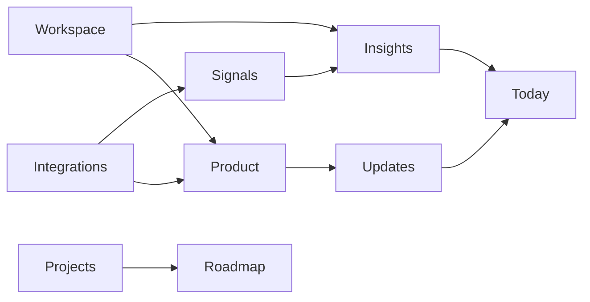

# Platform Overview

Devplan's sidebar organizes your workspace into three areas: daily work, planning, and knowledge. Use this guide to understand what each page does and how they connect.

---

## Daily work

These pages are your starting point each day.

| Page | What it does |
|------|--------------|
| [Today](/platform/today) | AI-generated daily digests of what's changing across your workspace |
| [Ask Devplan](/platform/ask-devplan) | Conversational AI assistant scoped to your workspace |
| [Projects](/platform/projects) | Track and manage active projects |
| [Updates](/platform/updates) | Feed of what shipped recently in your product catalog |
| [Insights](/platform/insights) | Synthesized, role-aware takeaways from workspace signals |

---

## Specs

Planning views for your project portfolio. **Roadmap** appears under **Specs** when specs are enabled for your workspace.

| Page | What it does |
|------|--------------|
| [Roadmap](/platform/roadmap) | Portfolio planning across releases, kanban, and timeline views |

---

## Knowledge

Context and data sources that power AI output across the platform.

| Page | What it does |
|------|--------------|
| [Workspace](/platform/workspace) | Edit core workspace context — customers, goals, competitors |
| [Product](/platform/product) | Browse auto-generated feature catalogue and specs |
| [Signals](/platform/signals) | Raw evidence feed from connected sources |
| [Integrations](/platform/integrations) | Connect external tools that feed knowledge and signals |

---

## How the pages connect

**Integrations** bring in data from GitHub, Slack, Jira, and other tools. That data surfaces as **Signals**, which Devplan synthesizes into **Insights**. **Workspace** and **Product** context shape how relevant those outputs are. **Updates** and **Today** give you a daily view of what's changing, while **Projects** and **Roadmap** help you plan what to build next.

---

## Evidence pills

On [Today](/platform/today), [Insights](/platform/insights), and [Ask Devplan](/platform/ask-devplan), you'll see inline **evidence pills** — small badges showing source icons and a count like `3 sources`. Click a pill to open a flyout listing the references behind a claim, with links to the original PRs, tickets, Slack threads, and other connected sources.

---

## Availability notes

- **Roadmap** — visible when specs are enabled for your workspace
- **Insights** and **Signals** — may not appear in all workspaces

For setup steps, see [Getting Started](/quickstart). For the feature planning workflow, see [Core Workflow](/core-workflow). For account and workspace configuration, see [Settings Overview](/settings).
