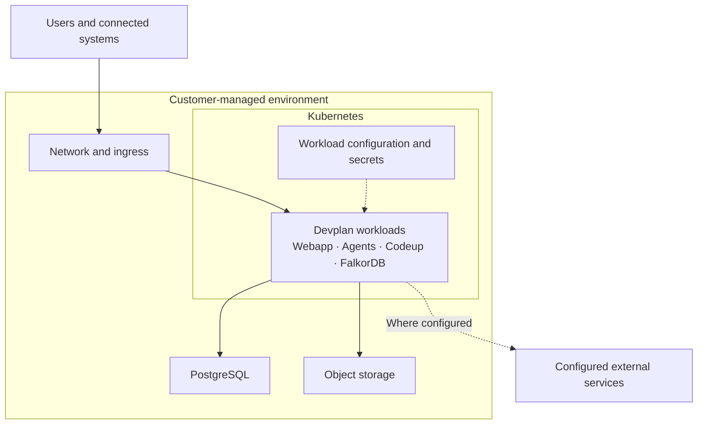
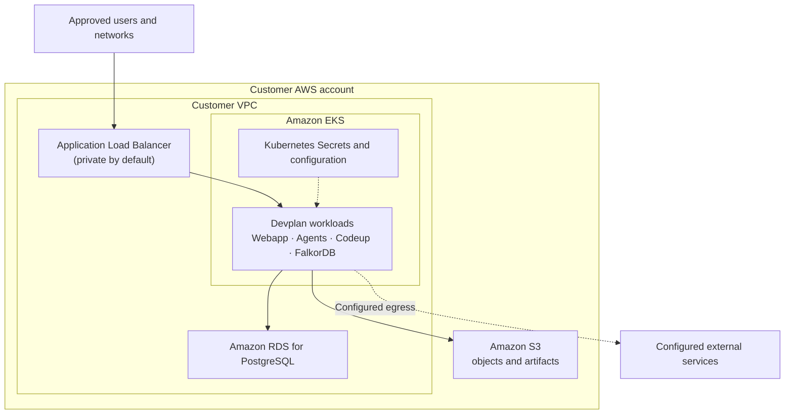

# Self-hosting Devplan

Devplan self-hosting is available for organizations that want Devplan application workloads in a customer-managed environment. Deployments are planned and coordinated with Devplan so that the infrastructure, security, network access, and data flows fit the organization.

## The common deployment model

The customer provides and controls the environment: a network boundary and ingress, a Kubernetes cluster, PostgreSQL, object storage, and the configuration and secrets used by workloads. Devplan supplies versioned application workloads that run in that cluster. The current package includes the Webapp and Agents services, Codeup orchestration and document processing, and an in-cluster FalkorDB graph store.

Users reach the Webapp through the customer's chosen network and ingress. The Webapp and background services work with Codeup; application data goes to PostgreSQL and objects or artifacts go to object storage. Codeup also uses the graph store inside Kubernetes. Configuration and secrets are supplied at the workload boundary. Integrations, model providers, and some supporting Devplan-operated services can remain external, depending on the deployment. Their access and data flows are reviewed with Devplan rather than assumed to be inside the customer environment.

| Responsibility | General boundary |
|---|---|
| Customer-managed infrastructure | Cloud account or equivalent environment, networking, Kubernetes capacity, PostgreSQL, object storage, access controls, and secret management. |
| Devplan application | Versioned Webapp, Agents, Codeup, and supporting in-cluster workloads, deployed into the customer environment in coordination with Devplan. |
| Shared deployment decisions | Ingress exposure, identity, external services, operational ownership, and data handling are agreed for the specific environment. |

## AWS reference architecture

AWS is one example of this model. The current self-hosting package includes AWS infrastructure provisioning; its application charts also accept GCP-specific configuration. The infrastructure and support scope for any deployment are coordinated with Devplan.

In this example, a customer-owned VPC contains EKS and a private RDS PostgreSQL database. EKS runs the Devplan workloads and the in-cluster graph store. Workloads use customer S3 buckets for objects and artifacts. The ingress is private by default; an internet-facing load balancer is an optional configuration. IAM Pod Identity grants the workloads access to AWS services, while Kubernetes Secrets carry application credentials. AWS KMS protects customer data resources, and Secrets Manager holds the RDS administrator secret. Network routing, certificate and DNS choices, and any external service access depend on the deployment.

The AWS example does not imply that every provider uses these AWS services, or that all data stays within one region. The chosen model provider, integrations, and approved supporting services can introduce external data flows.

## Discuss a deployment

Use **Contact Us** in the documentation footer to discuss self-hosting with Devplan. The team can review your infrastructure provider, security and data requirements, and the services your deployment would use.

For an overview of the product's information flow, see [How Devplan Works](/how-devplan-works).
