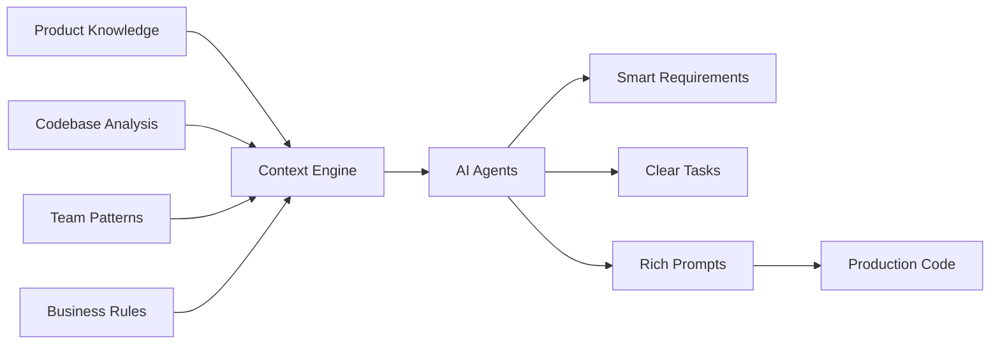

# Why Devplan? The Value Proposition

*5 min read • Understanding the problem Devplan solves and the proven results*

## The AI Development Gap

Despite massive AI adoption in software development, teams aren't seeing the productivity gains they expected. The problem isn't the AI—it's the missing context.

### The Reality of AI Development Today

:::warning Current State
**The Numbers:**
- **30-50% rework** required for AI-generated code in production
- **19% slower** senior developers when using generic AI tools (MIT study)
- **Only 10% productivity gains** for large codebases (Stanford study)
- **Most enterprise AI pilots are failing**
:::

### Why AI Tools Fall Short

**🔍 Missing Context**
Generic AI tools don't understand your specific codebase, architectural decisions, or business requirements.

**⚙️ Disconnected Workflows**
Planning happens in isolation from implementation, causing miscommunication and rework.

**📝 Generic Output**
AI generates code and requirements that don't fit your actual product or team standards.

**💬 Communication Gaps**
Teams waste hours clarifying vague specifications and conflicting assumptions.

## The Devplan Solution

Devplan bridges the context gap by connecting your entire development ecosystem—from product planning to code implementation.

### Context-Driven AI Development

**🎯 What Makes Us Different:**

1. **Deep Context Understanding** - Analyze your repos, docs, and team patterns
2. **Connected Intelligence** - Maintain context from idea to deployed code
3. **AI-Native Workflow** - Built for AI development, not retrofitted
4. **Production Quality** - Generate code that fits your patterns and standards

## Proven Results

### Quantified Impact

| Metric | Improvement | Time Saved |
|--------|-------------|------------|
| **Project Planning** | 8x faster | 80 min/feature |
| **AI Code Quality** | 25% better | 3+ hrs rework |
| **Requirements Clarity** | 90% reduction in clarification | 2+ hrs/feature |
| **Team Alignment** | 75% less back-and-forth | 1+ hr/day |

### Customer Success Stories

:::tip Customer Impact
> "We're running our 15-person VC-backed company without a PM. Devplan fills that gap—generating high-quality user stories that sync in Linear in minutes. What took me days now takes less than an hour."
>
> **— Andrew, YC-backed Founder**
:::

:::tip Developer Experience
> "DevPlan agents sometimes do a better job understanding the codebase and generating details than ClaudeCode."
>
> **— Design Partner Customer**
:::

:::tip Product Impact
> "This tool is a game-changer, helping us save tons of time when shaping app ideas with clarity. Devplan covers most aspects of the development process excellently."
>
> **— Seddick, Startup Product Leader**
:::

## Value by Role

### 👩‍💼 Product Managers

**Primary Benefits:**
- **AI-Assisted Discovery** - Smart questioning reveals missing requirements
- **Faster Spec Creation** - Generate detailed PRDs in minutes, not hours
- **Seamless Handoffs** - Technical context flows directly to engineering
- **Real-time Collaboration** - Work with engineers in shared context

**Time Savings:** 6-8 hours per feature planning cycle

### 👨‍💻 Engineering Teams

**Primary Benefits:**
- **Context-Rich Prompts** - AI coding with architectural understanding
- **Reduced Rework** - 25% improvement in AI-generated code quality
- **Clear Requirements** - No more guessing what specs mean
- **Integrated Workflow** - Context flows directly into your IDE

**Time Savings:** 3-5 hours per feature implementation

### 🏢 Engineering Leaders

**Primary Benefits:**
- **Predictable Delivery** - Accurate estimates based on complexity analysis
- **Better Planning** - Automated breakdown with timeline forecasting
- **Quality Assurance** - Context-driven development reduces technical debt
- **Team Alignment** - Shared understanding reduces overhead

**Strategic Impact:** 30-40% improvement in team velocity

### 🏛️ Organizations

**Primary Benefits:**
- **Faster Time-to-Market** - 8x planning improvement accelerates delivery
- **Better Resource Utilization** - Teams build instead of clarifying
- **Reduced Risk** - Clear specifications prevent project failures
- **Competitive Advantage** - First-mover benefit in AI-native development

**Business Impact:** 2-3x improvement in feature delivery speed

## The Future vs. Today

### Traditional Development (Today)
- ❌ Scattered information and context loss
- ❌ Manual, time-intensive planning processes
- ❌ Generic tickets with unclear requirements
- ❌ High-overhead sprint planning and communication
- ❌ AI tools working without proper context

### AI-Native Development (Devplan)
- ✅ Connected context and intelligence
- ✅ AI-driven planning and estimation
- ✅ Detailed, context-rich specifications
- ✅ Automated project breakdown and sequencing
- ✅ AI coding with rich, relevant prompts

## ROI Calculator

**Small Team (5 developers):**
- Planning time saved: 40 hrs/month
- Rework reduction: 60 hrs/month
- **Total savings: $15,000/month**

**Medium Team (15 developers):**
- Planning time saved: 120 hrs/month
- Rework reduction: 180 hrs/month
- **Total savings: $45,000/month**

**Large Team (50+ developers):**
- Planning time saved: 400 hrs/month
- Rework reduction: 600 hrs/month
- **Total savings: $150,000/month**

*Based on $150/hr blended rate and measured improvements*

## Ready to Transform Your Team?

**Next Steps:**
- 📖 [Learn the workflow](/core-workflow) - See how context flows from idea to code
- 🚀 [Get started](/getting-started) - Set up your account and first project
- 🏗️ [Understand the architecture](/architecture) - Deep dive into how it works

**Questions?** Contact us at info@devplan.com or book a demo to see Devplan in action.