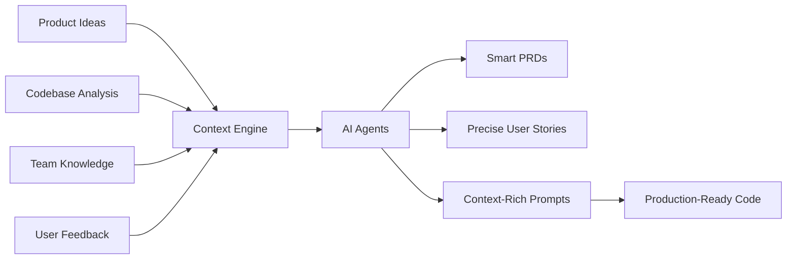

# Why Devplan? The Value Proposition

## The Problem: AI Isn't Delivering on Its Promise

Despite the excitement around AI in software development, teams are experiencing a significant gap between expectations and reality:

### Current AI Development Challenges

**📊 The Numbers Don't Lie:**
- AI-generated code requires **30-50% rework** in real-world applications
- Senior developers are actually **19% slower** when using AI coding tools (MIT study)
- Overall productivity gains are only **10%** for codebases over 100k lines of code (Stanford study)
- Most AI pilots in enterprise environments are failing

**🔍 Root Causes:**
- **Missing Context**: AI tools lack understanding of your specific codebase, product decisions, and company standards
- **Disconnected Workflows**: Planning happens in isolation from the technical implementation
- **Generic Output**: AI generates vague, non-specific requirements and code that doesn't fit your product
- **No Shared Understanding**: Teams waste time arguing in Slack about unclear specifications

## The Solution: Context-Driven AI Development

Devplan transforms AI from a generic code generator into an intelligent teammate that understands your product, codebase, and team context.

### How Devplan Delivers Real AI Value

**🎯 The Devplan Difference:**
1. **Deep Context Understanding**: We analyze your GitHub repos, product docs, team discussions, and user feedback
2. **Connected Workflows**: From idea to code, every step maintains context and intent
3. **AI-Native Experience**: Purpose-built for AI-assisted development, not retrofitted tools
4. **Production Quality**: Generate code that fits your patterns, follows your standards, and requires minimal rework

## Proven Results

### Performance Improvements
- **8x faster** project planning time
- **25% improvement** in AI coding quality
- **80 minutes saved** per feature in planning alone
- **Reduced rework** from better context and specifications

### Real Customer Impact

> "We are running our 15-person VC-backed company right now without a PM. Devplan helps fill that gap for us by generating high-quality user stories that sync in Linear in minutes. What used to take me days of back and forth and refinement I'm now doing in less than an hour."
>
> — **Andrew, YC-backed Founder**

> "DevPlan agents sometimes do a better job understanding the codebase and generating details than ClaudeCode"
>
> — **Design Partner Customer**

> "Great job! This tool is a game-changer, helping us save tons of time when shaping our app ideas with clarity. Devplan does an excellent job of covering most aspects of the development process."
>
> — **Seddick, Startup Product Leader**

## Value for Different Roles

### For Product Managers
- **Faster Spec Creation**: Generate detailed PRDs in minutes, not hours
- **Better Requirements**: AI agents ask the right clarifying questions based on your product context
- **Seamless Handoff**: Technical context flows directly to engineering teams
- **Real-time Collaboration**: Work directly with engineers in a shared context

### For Engineering Teams
- **Rich Context**: AI coding tools receive detailed prompts with architectural context
- **Reduced Rework**: Code generation that follows your patterns and decisions
- **Clear Requirements**: No more guessing what the PM meant
- **Integrated Workflow**: Prompts flow directly into your IDE via CLI

### For Engineering Leaders
- **Predictable Delivery**: Accurate estimates based on real complexity analysis
- **Better Planning**: Automated project breakdown with timeline forecasting
- **Quality Assurance**: Context-driven development reduces technical debt
- **Team Alignment**: Shared understanding reduces communication overhead

### For Organizations
- **Faster Time-to-Market**: 8x improvement in planning cycles accelerates delivery
- **Better Resource Utilization**: Teams spend time building, not clarifying requirements
- **Reduced Risk**: Clear specifications and context reduce project failures
- **Competitive Advantage**: First-mover advantage in AI-native development

## The Future of Product Development

Devplan represents the evolution from traditional, disconnected toolchains to an integrated, AI-native development platform:

**Old Way:**
- Scattered feedback and ideas
- Manual planning and estimation
- Generic tickets and specifications
- High overhead sprint planning
- Manual coding and status reporting

**Devplan Way:**
- Connected context and intelligence
- AI-driven planning and estimation
- Detailed, context-rich specifications
- Automated project breakdown
- AI-enabled coding with rich prompts

## ROI and Business Impact

**Immediate Returns:**
- Reduce planning overhead by 80%
- Decrease AI coding rework by 25%
- Accelerate feature delivery by 8x
- Improve cross-team collaboration

**Strategic Benefits:**
- Build competitive advantage through faster iteration
- Improve product quality through better requirements
- Scale engineering effectiveness without proportional hiring
- Create institutional knowledge that grows with your team

Ready to experience the difference context makes? [Get started with Devplan](/getting-started).